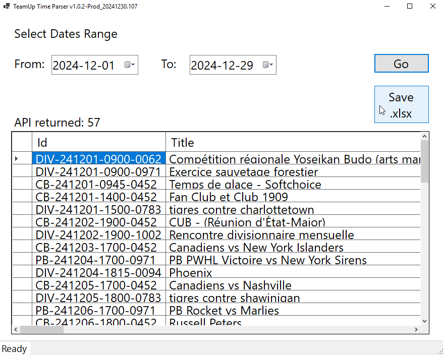
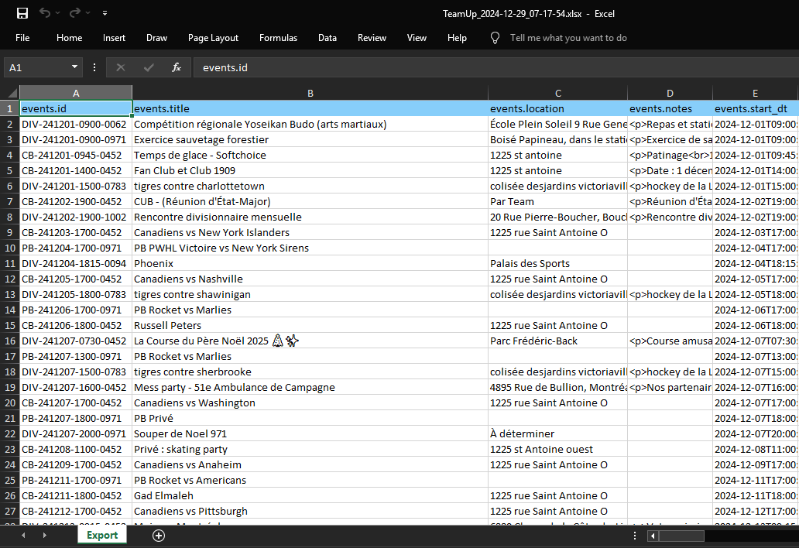

# TeamUpWebScraper

WinForms App to parse a TeamUp Calendar 

and return data in Excel spreadsheet report format.


## Configuration
This project uses a config file, it is required for the application to start.
By default, the config folder is not deployed. If you are trying to run this application,
you may create manually a `config` folder inside the application folder (where the .exe is)
and add a `appsettings.json` inside ex: `config/appsettings.json`.

You may take the "Development" version of that config, that is in the github repo
[src/TeamUpWebScraperUI/config/appsettings.json](./src/TeamUpWebScraperUI/config/appsettings.json)

Make sure to change the following values:
```json
"TeamUpAPI": {
		"TeamupToken": "[YOUR_API_KEY]",
		"CalendarId": "[YOUR_CALENDAR_ID]",
	},
	...
```

## Keep in mind the environmental variables specifieed in UI project
(They are in project properties > Debug/General > Open Debug Launch Profiles UI > Environment Variables)
(Or in Solution Explorer > Properties > launchSettings.json)
* BUILD_NUMBER = DEV_ENV
* DOTNET_ENVIRONMENT = Development


## To Do List

- ✅ Dependency Injection
- ✅ Serilog Logger + Rotating File
- ✅ Unit tests (xUnit, FluentAssertions, NSubstitute, bogus)
- ✅ Add versionning with build and environment variables
- ✅ write tests with _teamUpAPIService mocked with nSubstitute using provided json file
- ✅ write logic that transforms the data recieved from API into a model that will go to Excel
- ✅ Model for Excel Table
- ✅ Display minimal values in the UI
- ✅ Excel spreadsheet report provider
- ✅ Use Verify & Verify.xUnit for some of the bigger expected objects in tests https://github.com/VerifyTests/Verify
- ✅ Use FluentValidations for input validator
- ✅ Add config section and model for Excel SpreadSheet provider
- ✅ Highlight in yellow Excel report lines that have words matching a RegEx in config (Annule, Cancelled, Reporte)
- ✅ Read from config this private const int MAX_DAYS_SPAN_LIMIT = 60;
- ✅ Write additional tests for GetEvents & GetSubcalendars routes of TeamUpAPI service
- ✅ Read Calendars from API route (not from mapping)  `/subcalendars` https://teamup.stoplight.io/docs/api/046361930f27a-get-a-collection-of-sub-calendars
- ✅ Tests (Exploration tests (uncomment)) Excel for a produced excel file
- 🔲 Remove HTML tags from note field HTML Agility pack  HtmlEntity.DeEntetize(document.DocumentNode.innertext)
- 🔲 Make Excel Report a table
- 🔲 UI Testing with Appium (complexity, have to actually install WinAppDriver on your machine)
- 🔲 Make CI/CD pipelines work with Environment variables instead of \<FileVersion>DEV_ENV\</FileVersion>  and /p:FileVersion=$env:BUILD_NUMBER
- ❌ (Cancelled not recommended) AutoMapper converting your model objects to Excel formats or from API responses to domain models
