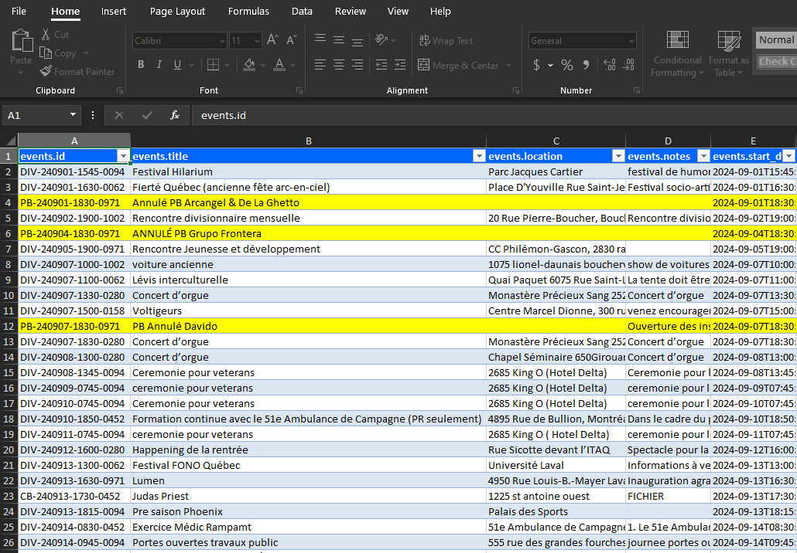

[](https://github.com/Habilya/TeamUpWebScraper/actions/workflows/dotnet-desktop.yml?query=branch%3Amain)

[](https://github.com/Habilya/TeamUpWebScraper/releases)
[](https://github.com/Habilya/TeamUpWebScraper/blob/main/LICENSE)
[](https://github.com/Habilya/TeamUpWebScraper)


# TeamUpWebScraper

WinForms App to parse a TeamUp Calendar using API,
and return data in Excel spreadsheet report format.

### Application interface

### Excel report


## Configuration
This project uses a config file, it is required for the application to start.
By default, the config folder is not deployed. If you are trying to run this application,
you may create manually a `config` folder inside the application folder (where the .exe is)
and add a `appsettings.json` inside ex: `config/appsettings.json`.

You may take the "Development" version of that config, that is in the github repo
[src/TeamUpWebScraperUI/config/appsettings.json](./src/TeamUpWebScraperUI/config/appsettings.json)

Make sure to change the following values:
```json
"TeamUpAPI": {
  "TeamupToken": "[YOUR_API_KEY]",
  "CalendarId": "[YOUR_CALENDAR_ID]",
},
...
```

## Keep in mind Versionning

in: `TeamUpWebScraperUI.csproj`
```xml
<Version>1.0.5</Version>
<InformationalVersion>DEV_ENV</InformationalVersion>
```

InformationalVersion - is the build number, will be replaced by the actual value in the pipeline
Ex.: **Prod_20250105.114**

### How it is set in the pipeline:
```yml
env:
	DOTNET_ENVIRONMENT: Prod

# Get today's date in yyyyMMdd format using PowerShell's Get-Date cmdlet
$TODAY = (Get-Date).ToString('yyyyMMdd')
        
# Combine date with the GitHub run number to create BUILD_NUMBER
$BUILD_NUMBER_LOC = "${{ env.DOTNET_ENVIRONMENT }}_$TODAY.${{ github.run_number }}"

# Set the BUILD_NUMBER as an environment variable for subsequent steps
echo "BUILD_NUMBER=$BUILD_NUMBER_LOC" >> $env:GITHUB_ENV
```

in msbuild command argument `/p:InformationalVersion=$env:BUILD_NUMBER`


## To Do List

- ✅ Dependency Injection
- ✅ Serilog Logger + Rotating File
- ✅ Unit tests (xUnit, FluentAssertions, NSubstitute, bogus)
- ✅ Add versionning with build and environment variables
- ✅ write tests with _teamUpAPIService mocked with nSubstitute using provided json file
- ✅ write logic that transforms the data recieved from API into a model that will go to Excel
- ✅ Model for Excel Table
- ✅ Display minimal values in the UI
- ✅ Excel spreadsheet report provider
- ✅ Use Verify & Verify.xUnit for some of the bigger expected objects in tests https://github.com/VerifyTests/Verify
- ✅ Use FluentValidations for input validator
- ✅ Add config section and model for Excel SpreadSheet provider
- ✅ Highlight in yellow Excel report lines that have words matching a RegEx in config (Annule, Cancelled, Reporte)
- ✅ Read from config this private const int MAX_DAYS_SPAN_LIMIT = 60;
- ✅ Write additional tests for GetEvents & GetSubcalendars routes of TeamUpAPI service
- ✅ Read Calendars from API route (not from mapping)  `/subcalendars` https://teamup.stoplight.io/docs/api/046361930f27a-get-a-collection-of-sub-calendars
- ✅ Tests (Exploration tests (uncomment)) Excel for a produced excel file
- ✅ Remove HTML tags from note field HTML Agility pack  HtmlEntity.DeEntetize(document.DocumentNode.innertext)
- ✅ Make Excel Report a table
- ✅ API Retry Logic with Polly to handle intermittent network failures or temporary unavailability of the external API. Use policies for retrying requests on failure with exponential backoff.
- ✅ Add Ben.Demystifier for better formatted exceptions stack logging
- ✅ Decouple UI from Library
- 🔲 Look to replace FluentAssertions with shouldly https://github.com/shouldly/shouldly
- 🔲 Replace Polly with microsoft built in retry policy Extensions.resiliance
- 🔲 Localization / Internationalization  NuGet package: Localization.Json
- ❌ (Cancelled paid external services) Error Reporting / Crash Logging NuGet package: Sentry or Rollbar crash reporting service like Sentry to track unhandled exceptions, application crashes, and other error details automatically.
- ❌ (Cancelled complexity) UI Testing with Appium (complexity, have to actually install WinAppDriver on your machine)
- ❌ (Cancelled) The ENV variables are passed as BUILD env variables, but there is no simple way to pass them as runtime env Variables. The bes I could do is to pass \<InformationalVersion>DEV_ENV\</InformationalVersion>.  Make CI/CD pipelines work with Environment variables instead of \<FileVersion>DEV_ENV\</FileVersion>  and /p:FileVersion=$env:BUILD_NUMBER
- ❌ (Cancelled not recommended) AutoMapper converting your model objects to Excel formats or from API responses to domain models
